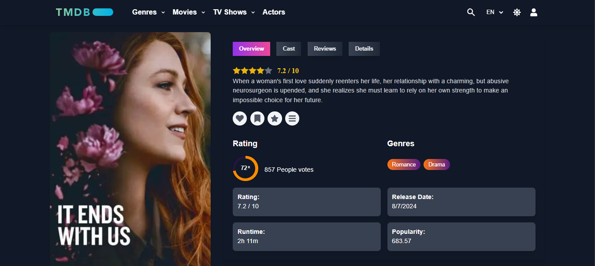
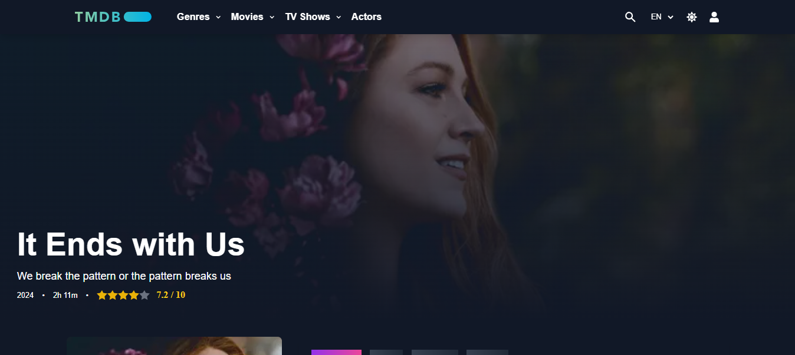
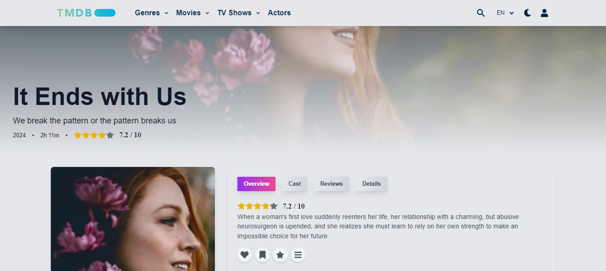
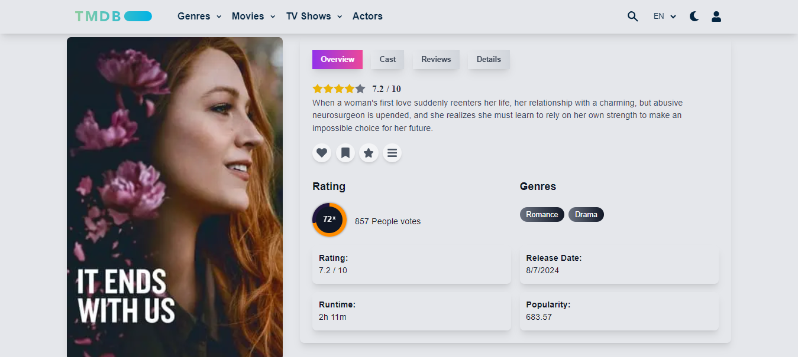
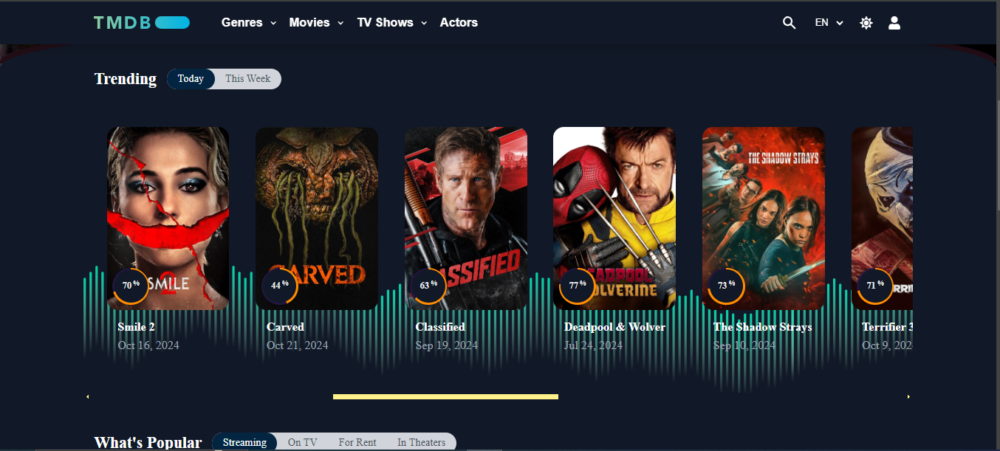
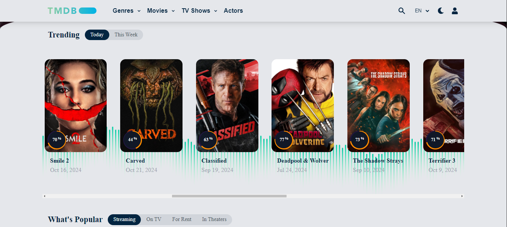
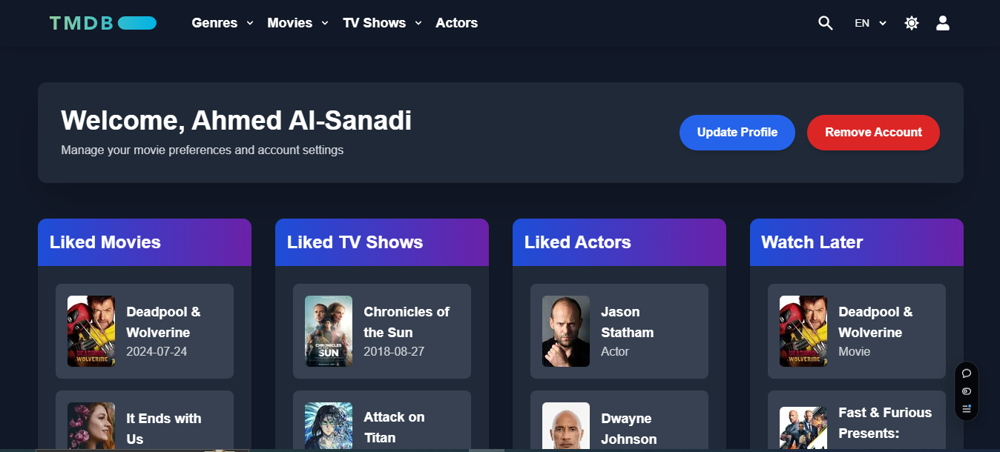
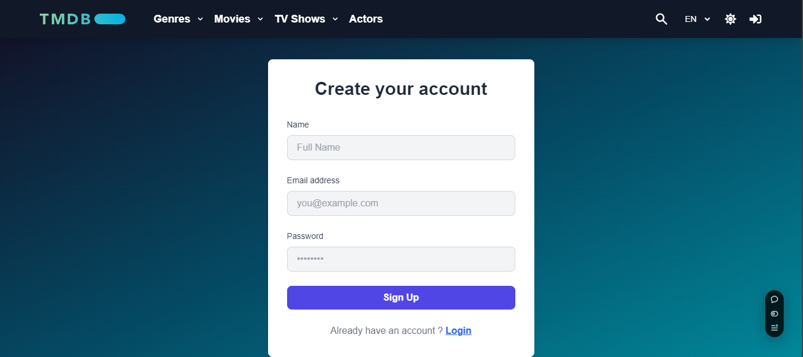

# 🎬 Movie Streaming App

<div align="center">
   

---

<div align="center">
  Made with ❤️ by [Ahmed Al-Sanadi]
  
  ⭐ Star this repo if you find it helpful!
</div>

  
  
  
  
  
  
</div>

## ✨ Overview

Experience cinema like never before with our feature-rich movie streaming platform! Built with cutting-edge technologies, this app brings the magic of movies and TV shows right to your screen, complete with a seamless user experience and stunning visual design.


**Why you'll love this app**:
- 🍿 **Discover, explore, and save** your favorite movies and TV shows.
- 🎨 **Dark/Light Mode** for a tailored viewing experience.
- 🌍 **Multi-language Support** for diverse audiences.

## 🚀 Key Features

### 🎯 Core Functionality
- **🔍 Advanced Search & Discovery**: Search movies, shows, or actors with ease.
- **💡 Light/Dark Mode**: Switch between sleek dark and clean light modes.
- **🌐 Multi-language Support**: Available in **English**, **Arabic**, and **French**.
- **🧑‍💻 Personalized User Profiles**: Keep track of your favorite movies and shows in your watchlist.
- **📱 Fully Responsive**: Looks great on any screen size, from mobile to desktop.

### 🛠️ Technical Features
- **⚡ Next.js**: Enjoy lightning-fast server-side rendering for a smooth user experience.
- **🔥 Firebase**: Authentication, data storage, and more, seamlessly integrated.
- **🎨 Tailwind CSS**: A utility-first CSS framework for rapid UI development.
- **🌍 i18next**: Effortless multi-language support for a global user base.

## 🎨 Screenshots Showcase

<details>
<summary>Click to expand and explore the visual beauty</summary>

### 🎬 Movie Details & More
<div align="center">
  
  
</div>

<div align="center">
  
  
</div>

### 🏠 Home Experience
<div align="center">
  
  
</div>

### 👤 User Profile & Auth
<div align="center">
  
  
</div>

</details>

## 🚀 Quick Start

### Prerequisites

Before you begin, ensure you have the following installed:
```bash
Node.js v14+
npm or yarn
```

### 🛠️ Installation & Setup

1. **Clone the repository**
   ```bash
   git clone https://github.com/ahmedalsanadi/Movie-Streaming-App.git
   cd Movie-Streaming-App
   ```

2. **Install dependencies**
   ```bash
   npm install
   ```

3. **Environment Configuration**

   To fetch movie data and use Firebase services, create a `.env.local` file in the root of your project with the following environment variables:

   ```bash
   NEXT_PUBLIC_API_KEY=your_tmdb_api_key
   NEXT_PUBLIC_FIREBASE_API_KEY=your_firebase_api_key
   NEXT_PUBLIC_FIREBASE_AUTH_DOMAIN=your_firebase_auth_domain
   NEXT_PUBLIC_FIREBASE_PROJECT_ID=your_firebase_project_id
   NEXT_PUBLIC_FIREBASE_STORAGE_BUCKET=your_firebase_storage_bucket
   NEXT_PUBLIC_FIREBASE_MESSAGING_SENDER_ID=your_firebase_messaging_sender_id
   NEXT_PUBLIC_FIREBASE_APP_ID=your_firebase_app_id
   ```

4. **Launch the app**
   ```bash
   npm run dev
   ```

Open your browser and navigate to `http://localhost:3000` to view the app!

## 🎮 Features Guide

### User Features
- **🔐 Authentication**: Secure login, registration, and profile management with Firebase.
- **🔍 Discovery**: Browse thousands of movies, TV shows, and actors.
- **💾 Watchlists**: Add movies to your personalized list.
- **🌍 Language Support**: Toggle between **English**, **Arabic**, and **French**.
- **🌓 Light/Dark Mode**: A toggle for personalized viewing.

### Developer Features
- **🔧 ESLint & Prettier**: Ensure code quality with automated linting and formatting.
- **🛠 Husky Hooks**: Pre-commit hooks ensure high code standards with **lint-staged**.

## 🤝 Contributing

We appreciate contributions! Here’s how you can contribute:

1. **Fork the repository**
2. **Create your feature branch** (`git checkout -b feature/AmazingFeature`)
3. **Commit your changes** (`git commit -m 'Add some AmazingFeature'`)
4. **Push to the branch** (`git push origin feature/AmazingFeature`)
5. **Open a pull request**

## 📜 License

This project is licensed under the MIT License - see the [LICENSE](./LICENSE) file for details.

---

<div align="center">
  Made with ❤️ by [Ahmed Al-Sanadi]
  
  ⭐ Star this repo if you find it helpful!
</div>

---